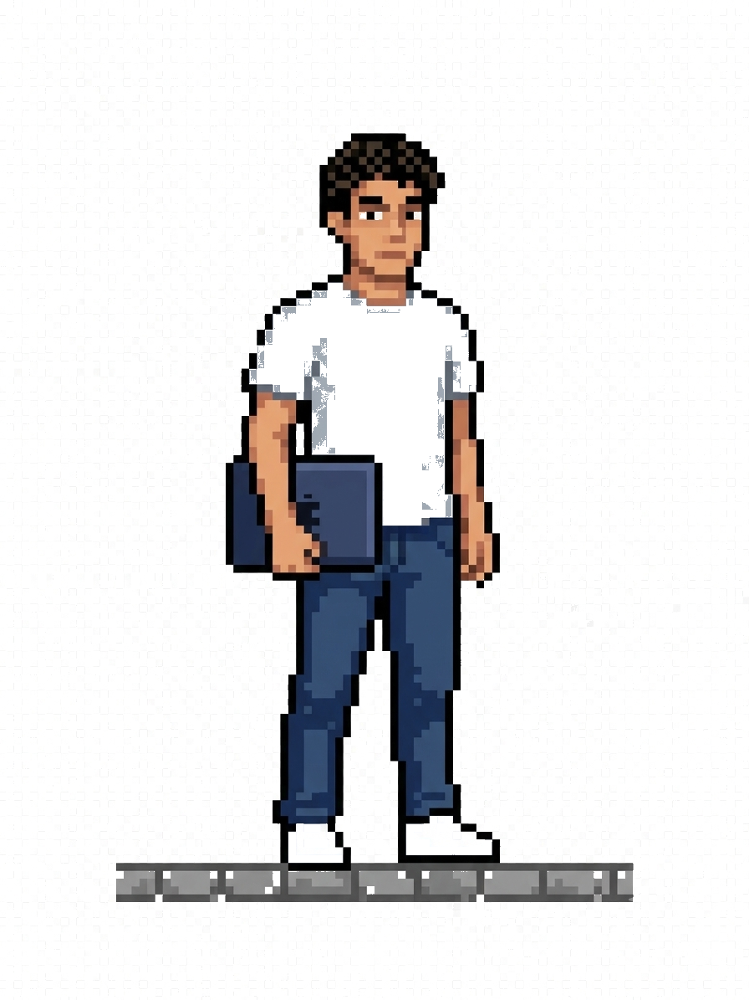
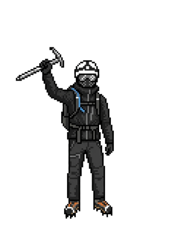
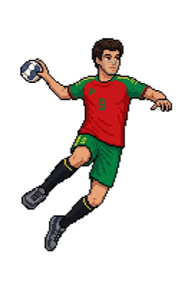
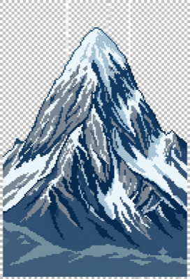

<table align="center">
<tr>
  <td width="200" align="center" valign="middle">
    
  </td>
  <td align="center" valign="middle">
    <h3>👋 Hi there, I'm Rodrigo Marcelino</h3>
    

      
      
    

  </td>
  <td width="200" align="center" valign="middle">
    
    
  </td>
</tr>
</table>

---

I'm a Computer Science Engineering student at <a href="https://www.fct.unl.pt/">NOVA School of Science and Technology</a>, with a solid foundation in programming languages such as Java, C, C++, and OCaml. I contribute to the <a href="https://www.orekit.org/">Orekit</a> astrodynamics library and have experience leading a multidisciplinary team to develop innovative projects, including a wearable safety device.

---

  

---

<table align="center">
<tr>
  <td>
    
  </td>
  <td>
    
  </td>
</tr>
</table>

---

### 🌐 Languages

<table align="center">
  <tr>
    <td>
      <table>
        <tr><th align="left">Language</th><th align="center">Proficiency</th></tr>
        <tr><td>🇵🇹 Portuguese</td><td align="center">Native</td></tr>
        <tr><td>🇬🇧 English</td><td align="center">Fluent</td></tr>
        <tr><td>🇪🇸 Spanish</td><td align="center">Intermediate</td></tr>
      </table>
    </td>
    <td width="160" align="center" valign="middle">
      
    </td>
  </tr>
</table>

---

### 🛠️ Languages and Tools

---

### 📈 Contribution Graph

<picture>
  <source media="(prefers-color-scheme: dark)" srcset="https://raw.githubusercontent.com/rsmarcelinoo/rsmarcelinoo/output/github-contribution-grid-snake-dark.svg" />
  <source media="(prefers-color-scheme: light)" srcset="https://raw.githubusercontent.com/rsmarcelinoo/rsmarcelinoo/output/github-contribution-grid-snake.svg" />
  
</picture>

---

- 🔭 Currently working as **Computer Science Engineering Student** at **NOVA SST**
- 📍 Based in: **Lisbon / Leiria, Portugal**
- 📫 Reach me: [r.marcelino@campus.fct.unl.pt](mailto:r.marcelino@campus.fct.unl.pt)
- ⚡ Fun fact: I have an Advanced Diploma in Double Bass and have been involved in various volunteering activities, including fundraising and data analytics for web summit. I am into Handball and Mountaineering

---

  

